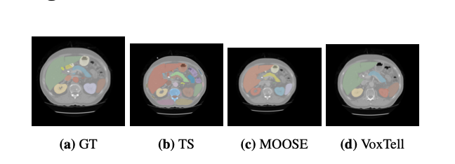

# Multi-Organ CT Segmentation Benchmark — MOOSE vs TotalSegmentator vs VoxTell

A reproducible benchmark comparing three publicly available automated organ-segmentation
tools — **MOOSE**, **TotalSegmentator**, and **VoxTell** — across up to 16 abdominal/thoracic
organs on public CT datasets, scored with Dice (DSC) and IoU (Jaccard).

The study is deliberately **staged** — small pilot → wider organ set → full run — to test
whether conclusions drawn from a small pilot survive at adequate sample size. They don't:
the "best" tool changes as sample size and organ count grow, which is the central finding.



*Ground-truth vs. predicted segmentation (GT / TotalSegmentator / MOOSE / VoxTell) on a representative subject from the public FLARE22 dataset.*

> Runs entirely on **public datasets** (FLARE22, the TotalSegmentator benchmark dataset).
> No patient or clinical data is included in this repository.

---

## Key Finding

No single tool dominates across all conditions:

| Stage | Sample | Organs | Overall winner (mean Dice) |
|-------|--------|--------|----------------------------|
| 1 — FLARE22 pilot | N=10 | 4 | **VoxTell** |
| 2 — TotalSeg pilot | N=10 | 16 | **VoxTell** (narrowly) |
| 3 — TotalSeg full | N=50 | 16 | **MOOSE** |

The ranking reverses as the organ set widens and sample size grows — small pilots are
directional, not conclusive. Liver converges to a near three-way tie at N=50. A fuller
write-up (methodology, per-organ tables, figures, discussion) is in the technical report.

📄 **[Technical report (PDF)](https://drive.google.com/file/d/11GA0wGWsxgoIZGpOn8EC_152Sk4LfFZW/view?usp=drive_link)**

---

## What the pipeline does

- Runs each of the three tools on the **same fixed subject sample** (seeded) so scores are
  directly comparable across tools.
- **Auto-discovers the common organ set** shared by all three tools + ground truth at runtime
  (reads each tool's own label map), rather than hard-coding label IDs — avoiding silent
  mismatches when tool versions change.
- Scores **Dice + IoU** per organ, per subject, per tool, and emits comparison tables and
  publication-quality figures.
- Every stage is **resumable** — re-running skips already-completed subjects.

---

## Prerequisites

**Hardware**
- NVIDIA GPU with CUDA (all three tools require it)
- ~50 GB disk for model weights + outputs

**Datasets** (public)
- [FLARE22](https://flare22.grand-challenge.org/) — abdominal CT, 4-organ pilot
- [TotalSegmentator dataset](https://zenodo.org/record/6802614) — whole-body CT, 16-organ runs

**Python environment** (3.9+)
```bash
pip install nibabel numpy torch totalsegmentator moosez huggingface_hub matplotlib seaborn pandas
```

**Segmentation tools** (must be on PATH)
- TotalSegmentator: `pip install totalsegmentator`
- MOOSE: `pip install moosez`
- VoxTell: see the [VoxTell install guide](https://github.com/mrokuss/VoxTell); the model auto-downloads on first run

Verify everything is reachable:
```bash
python ts_check_installs.py
```

> **Paths:** each script has a small `PATHS` block at the top (`DATASET_DIR`, results dir, etc.).
> Edit these to point at your dataset and output locations before running.

---

## Scripts — run in order

| Step | Script | What it does |
|------|--------|--------------|
| 0 | `ts_check_installs.py` | Verifies MOOSE / TotalSegmentator / VoxTell / CUDA are reachable |
| 1 | `ts_run_totalseg.py` | Runs TotalSegmentator → one multilabel `.nii.gz` per subject |
| 2 | `ts_run_moose.py` | Sets up folders, runs MOOSE (`clin_ct_organs`) on all subjects |
| 3 | `ts_discover_organs.py` | Computes the true organ intersection across all tools + GT → `ts_organ_config.json` |
| 4 | `ts_run_voxtell.py` | Runs VoxTell (per-organ binary output) on all subjects |
| 5 | `ts_evaluate.py` | Computes Dice + IoU for all tools × organs × subjects → `all_results.json` |
| 6 | `ts_results_table.py` | Prints the formatted comparison table |
| 7 | `ts_generate_graphs.py` | Saves 10 figures (bar / heatmap / box / violin / radar / …) |

Steps 1–4 are independent and can run in parallel. Step 3 needs at least one MOOSE output to exist first.

`ts_subject_sample.py` is a shared helper (fixed seed = 42) so every script evaluates the
**identical** subject sample — don't modify it if you want comparable results.

---

## Method notes

- **VoxTell is scored from per-organ binary output** (no `--save-combined`). Merging per-organ
  predictions into one multilabel volume corrupts voxels at adjacent-organ boundaries in a way
  unrelated to segmentation quality, so each tool is scored on its raw per-organ output.
- **Organ list is discovered, not hard-coded** — pulled from each tool's own label map plus
  on-disk ground-truth availability, with near-miss (naming-mismatch) flagging for manual review.
- **Comparisons require matched N** — `ts_results_table.py` flags any tool/organ with fewer than
  the expected subject count and withholds the "winner" summary until all Ns match.

---

## Metrics

- **Dice Similarity Coefficient (DSC)** — primary metric, 0 (no overlap) to 1 (perfect).
- **IoU (Jaccard)** — reported alongside; both computed per organ per subject, then averaged.

---

## Technical Report

A detailed report — architecture of each tool, staged methodology, full per-organ tables,
figures, modality-coverage analysis, and recommendations — is available here:

📄 **[Technical Report (PDF)](https://drive.google.com/file/d/11GA0wGWsxgoIZGpOn8EC_152Sk4LfFZW/view?usp=drive_link)**

---

## Citation

If you use this benchmark or its findings, please cite it. A `CITATION.cff` file is included,
so you can use the **"Cite this repository"** button in the GitHub sidebar, or:

> Leonard, C. S. (2026). *Multi-Organ CT Segmentation Benchmark: MOOSE vs TotalSegmentator vs VoxTell.* GitHub repository.

Please also cite the underlying tools and datasets you use — MOOSE, TotalSegmentator,
VoxTell, FLARE22, and the TotalSegmentator dataset (see their respective pages).

---

## License

Released under the [MIT License](LICENSE) — free to use, modify, and distribute, with
attribution. See the Citation section above if you use it in research.

---

## Notes & Scope

- Results are **CT-only**; MRI capability is discussed from published literature, not benchmarked here.
- TotalSegmentator was run in "fast" (3 mm) mode under an 8 GB VRAM constraint; its full-resolution
  model reports higher Dice, so these numbers are a lower bound for that tool.
- The scripts **run** the three tools and **score** their output; they do not modify or retrain the tools.

---

## Acknowledgements

All experiments use the
public FLARE22 and TotalSegmentator datasets; the three evaluated tools (MOOSE, TotalSegmentator,
VoxTell) are open-source projects by their respective authors.
